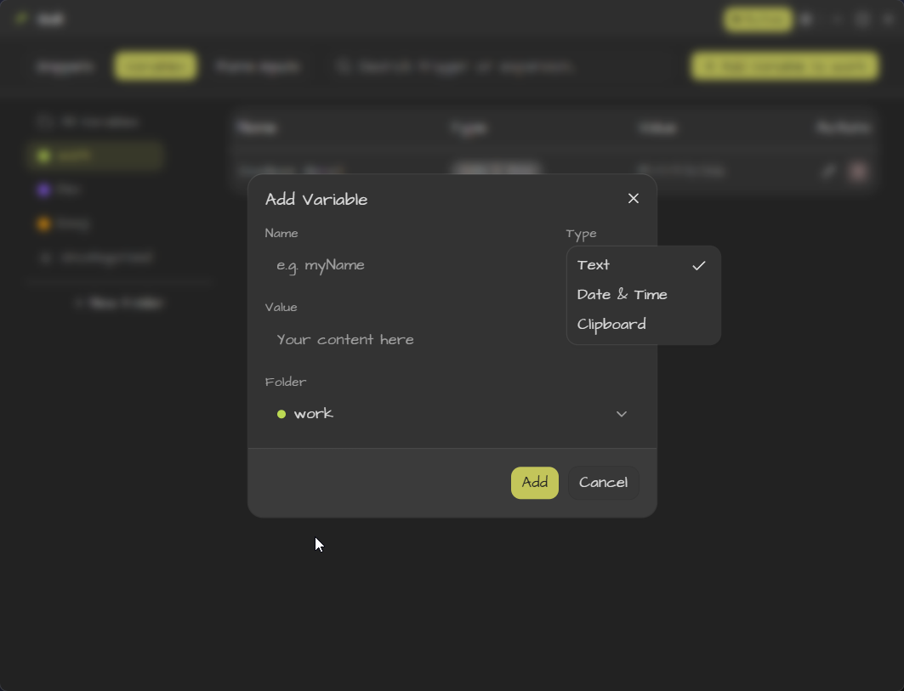
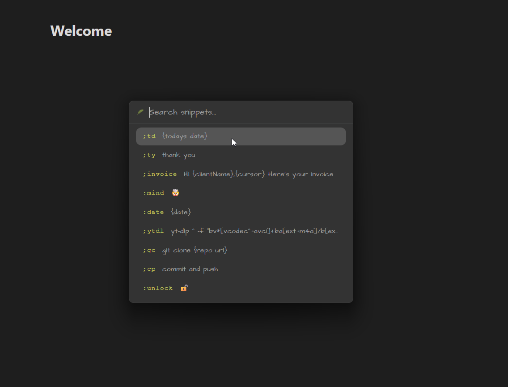
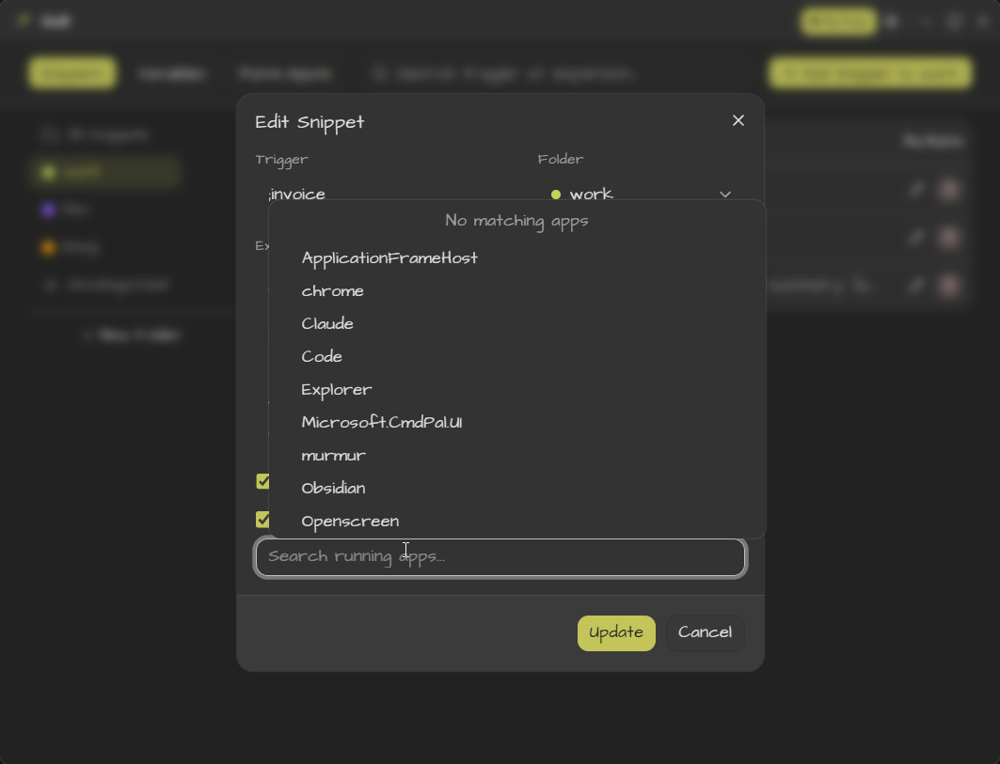

<picture>
  <source media="(prefers-color-scheme: dark)" srcset="public/quill-icon.png">
  
</picture>

# Quill

**Text expander for Windows** — type a short trigger, get a full snippet. No config files, no subscriptions, just works.

Type `;sig` → your email signature. Type `;addr` → your full address. Type `;date` → today's date formatted how you like. Quill runs in the system tray, fires text into any field in any app.

---

## Demo

https://github.com/user-attachments/assets/86c7f678-e3b9-4e60-9fb9-8a611cc411fa

<!--
Demo videos are in `public/`:
- `quill-hero.mp4` — main app walkthrough
- `form-input-demo.mp4` — form input expansion into a textarea
- `no-config-files.mp4` — out-of-box experience
- `variables-that-adapt.mp4` — dynamic variables demo
-->

| Feature | Screenshot |
|---------|-----------|
| Variables that adapt |  |
| Find snippet |  |
| Scoped to app |  |

## Features

- **Triggers & expansions** — Type `;shortcut` anywhere, get your full text
- **Variables** — Dynamic content in your snippets: date/time, clipboard, cursor position, custom prompts
- **Form inputs** — Build structured text templates with named fields, set types, defaults, and required validation
- **Folders** — Organize snippets into folders, scope them to specific applications
- **Search** — Instant search across all your snippets and folders
- **System tray** — Lives in the tray, accessible via hotkey `Ctrl+Shift+Space`

## Install

Download the latest MSI from [releases](https://github.com/Elixir-Piloting/quill/releases):

```
Quill_<version>_x64_en-US.msi
```

Run the MSI — Quill starts automatically on login.

Requirements: **Windows 10+**, 64-bit.

## Development

### Prerequisites

- [Node.js](https://nodejs.org/) 18+
- [pnpm](https://pnpm.io/)
- [Rust](https://www.rust-lang.org/tools/install)
- [WebView2](https://developer.microsoft.com/en-us/microsoft-edge/webview2/) (included on Windows 10+)

### Setup

```bash
pnpm install
```

### Run (dev mode)

```bash
pnpm tauri dev
```

### Build

```bash
pnpm tauri build
```

Output is at `src-tauri/target/release/bundle/msi/Quill_<version>_x64_en-US.msi`.

### Project structure

```
src/              — React frontend (Vite + TypeScript)
src-tauri/src/    — Rust backend (Tauri commands)
public/           — Static assets, screenshots, demo videos
```

## Contributing

1. Fork the repo
2. Create a feature branch (`git checkout -b feat/my-feature`)
3. Commit your changes (`git commit -am 'add my feature'`)
4. Push (`git push origin feat/my-feature`)
5. Open a Pull Request

Keep PRs focused on a single concern. Open an issue first for larger changes.

## License

MIT
